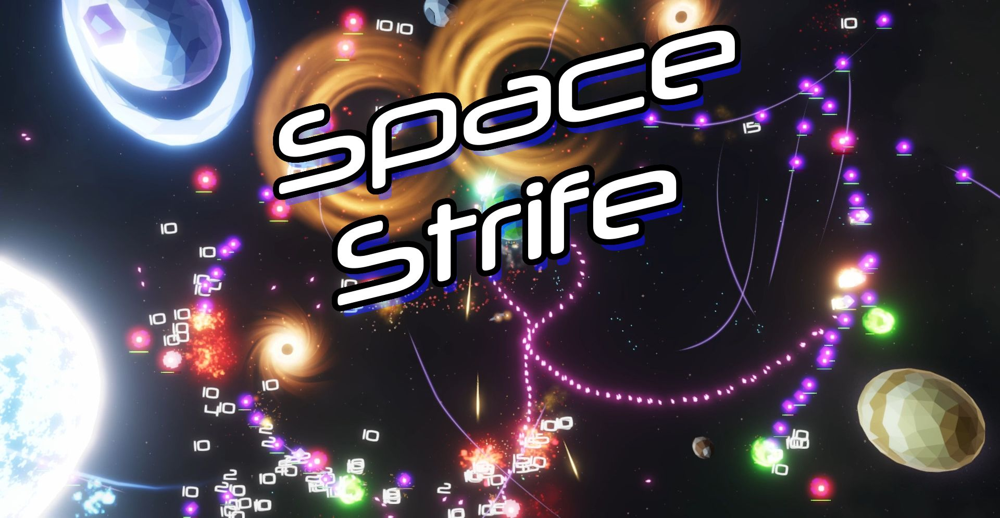

# Space Strife
A tower defence like game where you defend your planet against waves of enemies using a fleet of tanks.

Built using Unity 2022.3.60f, targetting Windows, macOS, Linux, Android and WebGL.

Current builds of the game are available on [itch.io](https://astrellon.itch.io/space-strife)

Devlog series available on [YouTube](https://www.youtube.com/playlist?list=PLTf8ZRLo3EcM2af7AtxFiqQySnzFKEprt)

## Architecture
The game world is setup as one continuous Unity scene and broken up into star systems which contain planets are other celestial objects. Star systems are revealed to the player as they progress. Each star system contains levels and are also revealed to the player as they progress. Each level is limited to the area around the planet where the level starts.

A level itself is made up of waves of enemies, mostly defined using splines but some have are special and use their own code. Each Wave defines how many ships are left and a level is essentially just a list of waves and keeps track of when all waves are finished. As the level just contains splines, the planets themselves are always present and are not created or destroyed at after the game starts.

## Top Level Managers
The top level manager classes are basically the Singleton's but with slightly more control over when they initialise. These classes exist for the entire lifetime of the game.

### Game Manager
The `GameManager` is the core manager that handles many aspects across starting the game to starting levels. Some areas could be split out into more specific managers like the damage indicators (number that come off enemies to indicate damage done).

Main responsibilities:
- Creating damage indicators.
- Keeping track of all the star systems (container for set of levels).
- Handling device orientation changes.
- Keeps track of input changes (mouse vs touch vs controller inputs).
- Starting/restarting/finishing a level.
- Updating game camera in reflection to UI state changes.

### UI Manager
The `UIManager` keeps track of the current UI state. The main purpose being handling showing and hiding different elements when the main state changes. Ideally it should be able to handle coming from and going to any UI state, however not all changes necessarily make sense. eg `InGameOptions` -> `MainMenuOptions` would mean showing the same options but the current game must have stopped.

Main responsibilities:
- Handles hiding previous state UI elements when changing to a new UI state (`MainMenu` -> `MainMenuOptions`)

### Audio Manager
The `AudioManager` keeps track of different audio mixers. It doesn't handle spawning all audio sources, many tied to 3D points in space are still created by the different effect prefabs. But for commonly used sources like for UI or dialogue sounds they are handled here. It also handles switching between different background music.

Main responsibilities:
- Playing UI and dialogue sounds and pooling of those audio sources.
- Handling updating different audio mixer volumes (master, sfx, ui, dialogue and music).

### Projectile Manager
The `ProjectileManager` handles all moving projectiles whilst a level is playing. This makes use of the Unity Jobs system. Internally each projectile type is handled using a different job which a basic way to make use of multithreading as well as making each job fairly straight forward. However because it is multithreaded the way projectiles are destroyed and damage is dealt to targets is split up between the async jobs and the in-sync projectile manager.

Before the specific projectile jobs are run, all targets are updated in a jobs compatible k-d tree (spatial querying structure). Then each projectile specific job can update the position, lifetime and checks for collisions using the just made k-d tree.

Once all the specific jobs have finished running the main `ProjectileManager` itself handles updating all the projectile objects (is the projectile now dead) as well as dealing the resulting damage to all the targets in a thread-safe manner.

Main responsibilities:
- Keeping track of all targets (all enemies and the player) and putting them into a k-d tree.
- Keeps track of gravity sources which can affect projectiles.
- Keeps track of all active projectiles and updating them using jobs.
- Dealing damage to all targets after all the projectiles have been updated.
- Triggers events when a target is dealt damage or destroyed.

### Portal Manager
Only used in the last level the `PortalManager` handles creating portals between different points in space and between levels. The portal manager handles keeping track of the currently opened portals, if they are on screen and updating the portal camera.

The portal effect is made up of a second camera that is positioned over the other portal which renders to a texture which is placed on top of everything else using a UI canvas element. This does make the effect rather expensive to render, but at the time of writing this I hadn't found a simpler way of achieving the same effect.

As this effect is only used in the last level it makes use of the fact that the player will be controlling a freely moving spaceship instead of a planet-bound tank. One aspect of keeping the player ship looking the same in both portal's whilst it moves across the portal is that it uses the `RenderPipelineManager` to override the spaceships position when the portal camera is rendering and then moves it back. I'm not sure if there are any major downsides to this, but one upside is that all the different elements of the ship don't need to be mirrored onto a proxy object. Such as the currently built tanks, the direction they are facing, current thrust effects, etc. All of that gets handled by this moving back and forth shortcut.

## Levels
Levels are split up into multiple parts. Some parts probably could be cleaned up and moved from the `Level` instance and put into the `LevelContainer` realistically.

### Level Container

The persistent level definition and location in world space which is the `LevelContainer` which defines a number of aspects about a level that is needed to be known before a level is started.

### Level Instance
The instanced level which is stored a `Level` prefab. This contains all the information about starting that specific level and will be created and destroyed each time a level is started or restarted/finished. The `Level` will usually contain all the `Waves` of enemies. Each of those waves will have triggers for when they should start, either through a timer or from checking how many enemies are left. Each of those triggers is usually also tied to a trigger. For example the final wave might show up if there's only one enemy left, but that should happen until the wave before it has started rather than being triggered at any time.

The final level is broken up into sub levels due to it's complexity in taking place across multiple star systems.

### Wave
Waves generally are made up of splines and a enemy type prefab. Each wave will generally start as soon as they are enabled, which means to control when a wave should start they should be disabled (the component) and let either the `Level` instance start it or use a trigger.

Whilst each of these triggers are specifically for `Waves` they are slightly more general and can be used to enable any kind of `Behaviour`.

#### ShipsLeftTriggerWave
Given a list of target waves, it will wait until all target waves have less than the required number of ships left before triggering something else (usually a `Wave`). Optionally there is a delay until the next thing is enabled.

#### TimeTriggerAfterWave
Once a specific wave target is enabled, this will start another component after a certain delay.

#### TimeTriggerWave
After a specific time has passed since this component has been enabled, it will enable another `Behaviour`.

### Wave Spawner
Wave spawners are another layer that sits on top of an existing wave. They basically highjack the wave by constantly increasing the number of target ships to spawn whilst the original spawner target is still alive and only once that target has been destroyed will the highjacked wave stop spawning. Perhaps a bit hacky.

### Level Scripts
The final part of a level is the script which is written in the `Lysithea` scripting language. The script generally handles the dialogue shown at the start, middle and end of a level, including the level description which is shown before a level is started. The `Lysithea` language was chosen partially because I (Alan Lawrey) wrote it and I wanted to battle test it, but also because it was designed for dialogue. Where the script is Lisp-like but also can be easily paused at any point by the game, which means that dialogue can be written like code, including using functions for reused aspects.

The script can also handle other aspects like checking for game flags to determine if dialogue or other effects should be triggered.

## Credits

**Unity Job Compatible KDTree**
- Arthur Brussee

**Joystick Pack**
- Fenerax Studios

**Shader Noise**
- keijiro

**Fonts**
- Neuropol Font
- Belanosima

**Character Portraits**
- CaptainSkeleto, modified by Alan Lawrey

**Free Sounds**
- Anomaex
- Kenney
- Little Robot Sound Factory
- Michel Baradari

Other scripts, meshes, textures by Alan Lawrey

## Author
Alan Lawrey 2025